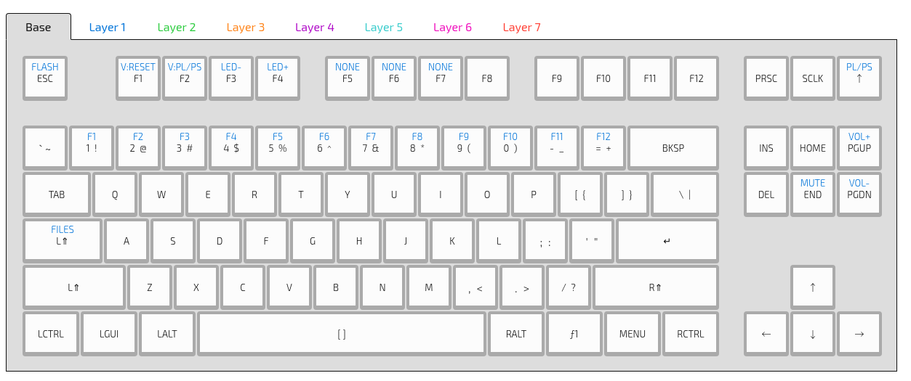

## K Type Keyboard Layout and Animation

## Setup

Install DFU Util

    sudo apt install dfu-util

Put your keyboard into flash mode - press pin on underside, or `ƒ+ESC`

Flash firmware

    sudo dfu-util -D kiibohd.dfu.bin 

## Animations

`ƒ+F5` - Christmas  
`ƒ+F6` - Miami Wave  
`ƒ+F7` - Custom Wave  

